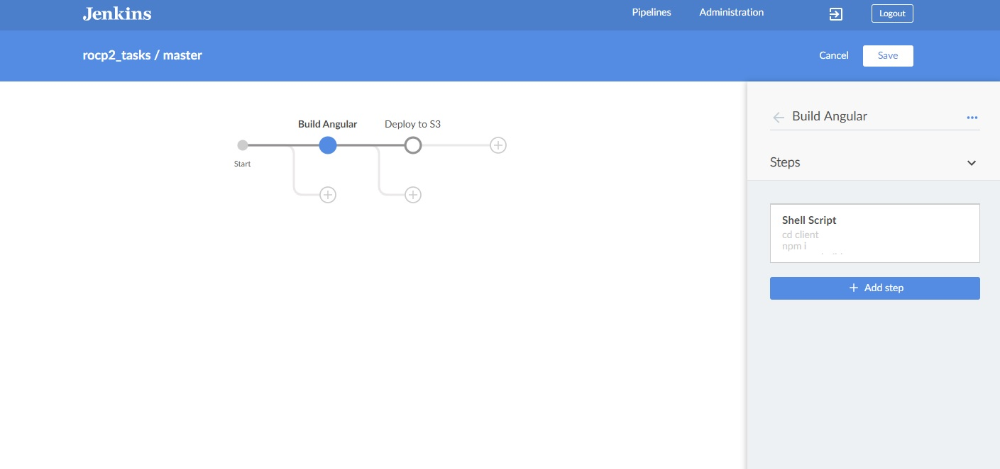
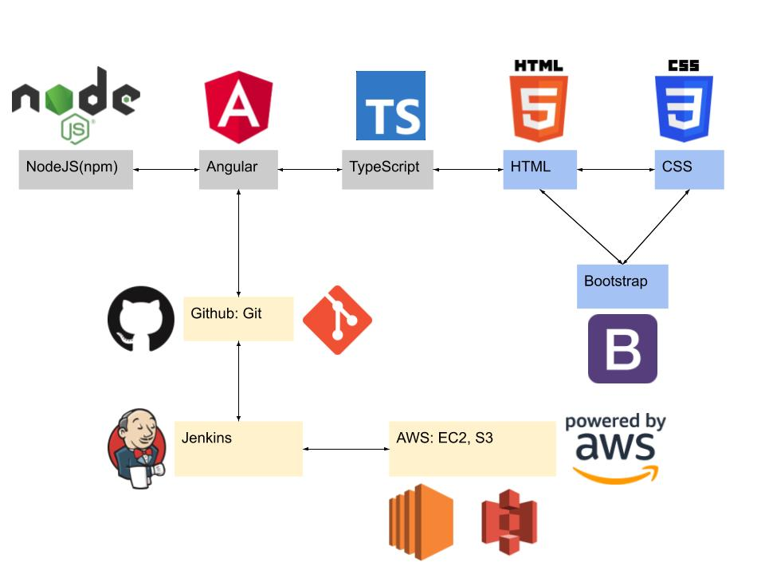

# TASKADOODLE - TASK MANAGER

## Application Details

## DEMO

This is a demonstration of our angular project Taskadoodle! It is a task manager with a built in kanban board. Features include the ability to add, complete tasks, move kanban tasks on the kanban board based on status, and see upcoming or past-due tasks on the dashboard. Includes a wide variety of sorting and filtering options.

The back-end was built on an AWS EC2 server with Jenkins handling automatic deployments.

### Requirements
Users can:
<ul>
    <li>View all tasks</li>
    <li>Filter/search tasks</li>
    <li>Select and view a singular task</li>
    <li>Create tasks</li>    
    <li>Update existing task</li>
    <li>Delete existing task</li>
    
</ul>
Deployment requirements:
<ul>
    <li>Deployed on AWS S3</li>
    <li>Backend hosted on EC2</li>
    <li>CI/CD process for frontend</li>
</ul>

## Technologies

<ul>
    <li>NodeJS (npm)</li>
    <li>Angular</li>
    <li>TypeScript</li>
    <li>HTML</li>
    <li>CSS</li>
    <li>Bootstrap</li>
    <li>Github: Git</li>
    <li>Jenkins</li>
    <li>AWS: EC2, S3</li>
</ul>

## Developers
<ul>
    <li>Sadia Ansari</li>
    <li>Sandy Moose</li>
    <li>David Otis</li>
    <li>Chris Ross</li>
</ul>